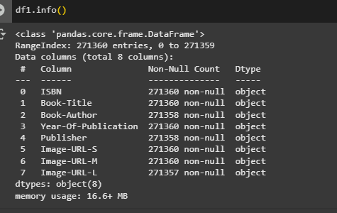
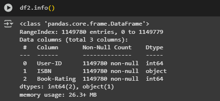

# Laporan Proyek Machine Learning - Ardiansyyah Putra

## Project Overview

Proyek ini bertujuan membangun sistem rekomendasi buku menggunakan dua pendekatan utama: Content-Based Filtering dan Collaborative Filtering. Dengan jumlah buku yang sangat banyak, pembaca membutuhkan bantuan sistem rekomendasi untuk menemukan buku yang sesuai preferensi mereka. Dataset diambil dari Kaggle: [Books Dataset by Saurabh Bagchi.](https://www.kaggle.com/datasets/saurabhbagchi/books-dataset)

Referensi:

 - Ricci, F., Rokach, L., & Shapira, B. (2011). Introduction to Recommender Systems Handbook. Springer.

 - Bobadilla, J., Ortega, F., Hernando, A., & Gutiérrez, A. (2013). Recommender systems survey. Knowledge-Based Systems, 46, 109–132.

## Business Understanding

### Problem Statements

 - Bagaimana memberikan rekomendasi buku yang relevan bagi pengguna berdasarkan histori interaksi mereka?

 - Apa pendekatan yang paling efektif dalam meningkatkan relevansi rekomendasi—berbasis konten atau kolaboratif?

### Goals

 - Mengembangkan sistem rekomendasi menggunakan pendekatan Content-Based dan Collaborative Filtering.

 - Membandingkan performa kedua pendekatan untuk memilih metode yang paling efektif.

    ### Solution statements
     - Pendekatan 1 - Content-Based Filtering: merekomendasikan buku berdasarkan kemiripan atribut dengan buku yang telah disukai pengguna.

     - Pendekatan 2 - Collaborative Filtering: merekomendasikan buku berdasarkan preferensi pengguna lain yang memiliki pola mirip.

## Data Understanding
Dataset terdiri dari tiga file utama yaitu books.csv,rating.csv,dan user.csv, tetapi dalam projek ini hanya memakai 2 file saja yaitu:

 - books.csv: metadata buku (271.360 baris, 8 kolom).

 - ratings.csv: rating pengguna (11.449.780 baris, 3 kolom).

fitur buku:

ISBN: kode unik buku.

Book-Title: judul buku.

Book-Author: nama penulis.

Year-of-publication : Tahun pertama kali buku tersebut diterbitkan.

publisher : Nama penerbit buku.

Image-URL-S : tautan gambar sampul buku berukuran kecil (small thumbnail).

Image-URL-M : tautan gambar sampul buku berukuran sedang (medium thumbnail).

Image-URL-L : tautan gambar sampul buku berukuran besar (large image), sering digunakan untuk tampilan detail.

fotur rating :

User-ID: identitas pengguna.

ISBN: kode unik buku.

Book-Rating: skor rating (0–10); rating = 0 dihapus karena dianggap tidak valid.

## Data Preparation

 - karena data terlalu banyak jadi hanya hanya diambil 30000 row dari book dataset dan 20000 row untuk rating dataset jadi masih terllihat cukup banyak.

 - menghapus data rating bernilai 0.

 - Rename kolom agar lebih konsisten.

 - mengubah dataframe dari buku menjadi sebuah list

 - membuat dictionary yang digunakan untuk memnentukan pasangan key-value pada book_ISBN, book_title, book_author, dan book_year_of_publication.

## Modeling

### Content-Based Filtering
   Content-Based Filtering adalah metode sistem rekomendasi yang memberikan rekomendasi kepada pengguna berdasarkan karakteristik atau atribut dari item (konten) yang disukai atau pernah dinikmati oleh pengguna tersebut sebelumnya.
   Pada content Based Filtering, kita akan menggunakan TF-IDF Vectorizer untuk membangun sistem rekomendasi berdasarkan penulis buku.
   TF-IDF yang merupakan kepanjangan dari Term Frequency-Inverse Document Frequency memiliki fungsi untuk mengukur seberapa pentingnya suatu kata terhadap kata - kata lain dalam dokumen. Kita umumnya menghitung skor untuk setiap kata untuk menandakan pentingnya dalam dokumen dan corpus.
      Berikut tahapan modeling dari content-based filtering :

 - Menggunakan fitur Book-Title dan Book-Author.

 - Mengubah teks pada fitur Book-author menjadi representasi vektor dengan TF-IDF.

 - Menghitung kemiripan antar buku menggunakan cosine similarity.

 - Rekomendasi diberikan berdasarkan kemiripan author dengan buku yang pernah dibaca oleh pengguna.

 #### kekurangan Content-based filtering

 - Rentan pada cold-start untuk item (jika metadata kurang informatif).

 - Kurang variasi rekomendasi (terlalu mirip dengan item sebelumnya).

 #### kelebihan Content-based filtering

 - Tidak tergantung pada interaksi pengguna lain.

 - Bisa merekomendasikan buku meski pengguna baru (asalkan pernah memberi rating).

### Collaborative Filtering

Collaborative Filtering adalah salah satu pendekatan dalam sistem rekomendasi yang memberikan rekomendasi kepada pengguna berdasarkan kesamaan perilaku atau preferensi antar pengguna atau antar item.
berikut adalah tahapan pelatihan modelnya:

 - meyandikan user_id dan book_id menjadi integer.

 - membagi dataset menjadi menjadi 70% untuk latih dan 30% untuk validasi.

 - menggunakan Model RecommenderNet untuk rekomendasi berbasis pendapat pengguna.

 - proses compile pada model dengan binary crossentropy sebagai loss function, adam sebagai optimizer, dan RMSE sebagai metrik dari model.

 - melatih model dengan batch_size 5 dan 20 epochs.

 - Menggunakan nilai rating pengguna yang sama untuk merekomendasikan buku.

 #### Kelebihan:

 - Memberikan rekomendasi yang lebih personal dan variatif.

 - Cocok jika pengguna memiliki cukup banyak interaksi.

#### Kekurangan:

 - Sering menghadapi masalah sparsity yaitu matriks interaksi pengguna-item (user-item matrix) sangat jarang terisi (banyak nilai kosong)..

 - Rentan terhadap cold-start pada pengguna baru saat sistem belum memiliki cukup data untuk pengguna atau item baru.

Pada Collaborative Filtering.

## Evaluation

### Metrik Evaluasi

Precision@K adalah metrik evaluasi yang mengukur proporsi item relevan dari K item teratas yang direkomendasikan oleh sistem kepada pengguna.

 #### Hasil Evaluasi
|Pendekatan	               |Metrik	         |Hasil  |
|--------------------------|-----------------|-------|
|Content-Based Filtering	|Precision@10	   |90.00% |
|Collaborative Filtering	|Precision@10	   |100.00%|

Precision@10 mengukur seberapa banyak dari 10 item rekomendasi teratas yang benar-benar relevan bagi pengguna, berdasarkan riwayat interaksi sebelumnya .

Dari hasil di atas dapat disimpulkan bahwa Collaborative Filtering mampu memberikan rekomendasi yang lebih akurat, dengan semua 10 item yang direkomendasikan sesuai dengan preferensi pengguna. Sementara itu, Content-Based Filtering juga memberikan performa yang baik, dengan tingkat relevansi sebesar 90%.

Hal ini menunjukkan bahwa pendekatan Collaborative Filtering berhasil menangkap pola preferensi pengguna secara lebih menyeluruh dengan memanfaatkan informasi dari pengguna lain yang memiliki kesamaan perilaku.